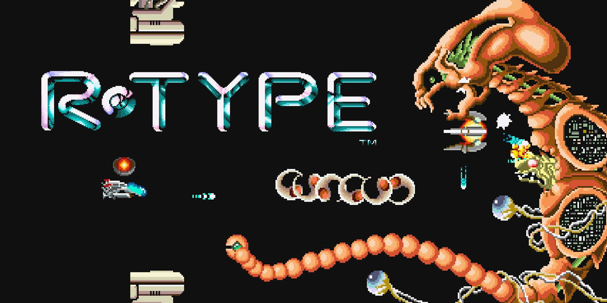
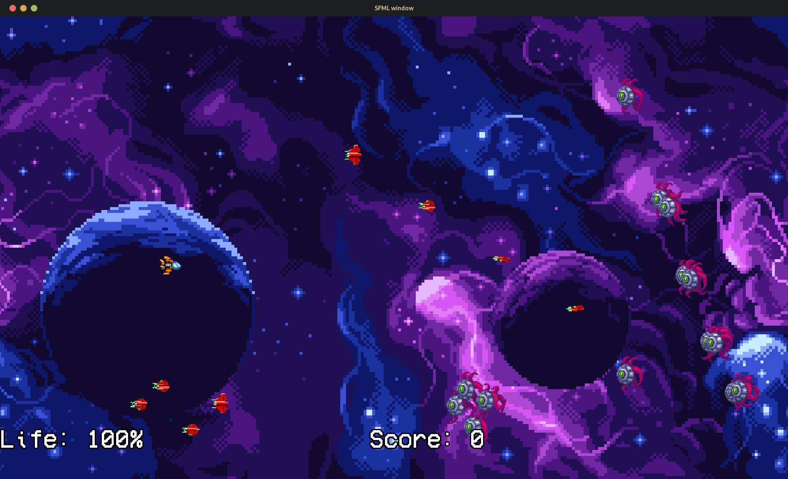
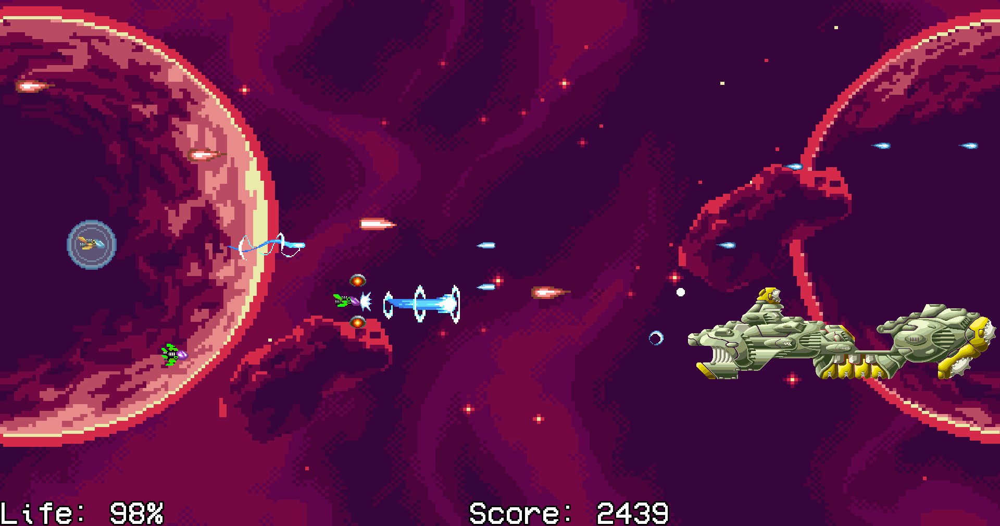

# R-Type

## Overview
Welcome to our documentation for the R-Type project! We made this project during our third year in EPITECH as part of the C++ module. The goal was to recreate the R-Type game.

## The R-Type Game
If you're old enough you might already know the game, but if you don't, here's a brief overview:

The first iteration of the game was released in 1987 by Irem. It's a side-scrolling shoot 'em up arcade game where you control a spaceship and fight against hordes of enemies. The game is known for its challenging gameplay and unique power-up system.
This is what we were told to reproduce, but with some twists: we had to make it **multiplayer** and **cross-platform**.

## Our view on the R-Type

Here is what we've manage to do for this project:

